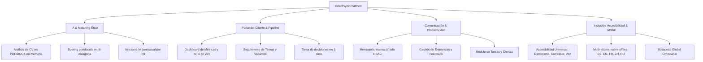

# 🚀 TALENTSYNC — COMMERCIAL SALES PITCH & VALUE FRAMEWORK
### Dossier Comercial Estratégico y Framework de Ventas B2B para Empresas, Consultoras y Departamentos de Talento Humano

---

## Executive Summary (Resumen Ejecutivo)

**TalentSync** es una plataforma integral de **Adquisición, Filtrado Inteligente y Gestión de Talento (Next-Gen ATS & Client Collaboration Portal)** diseñada para resolver la fragmentación operativa, los sesgos en la selección y la lentitud en los ciclos de contratación empresarial.

A diferencia de los sistemas tradicionales lentos y sobrecargados, TalentSync combina **análisis de CV impulsado por IA explicable y sin sesgos**, un **portal colaborativo en tiempo real para clientes y directores de área**, **mensajería segura multi-rol**, y una **suite de accesibilidad universal e internacionalización nativa**, todo sobre una arquitectura web ultrarrápida y segura.

```
+---------------------------------------------------------------------------------------------------+
|                                 TALENTSYNC VALUE ECOSYSTEM                                        |
+-----------------------------------+-----------------------------------+---------------------------+
|      CANDIDATOS TOP               |         RECLUTADORES              |     EMPRESAS CLIENTE      |
|  • Postulación transparente       |  • Screening con IA Explicable    |  • Portal de Seguimiento  |
|  • Accesibilidad universal (WCAG) |  • Pipeline ATS centralizado      |  • Feedback en 1-click    |
|  • Mensajería directa sin spam    |  • Búsqueda instantánea multi-criterio| • Ternas y métricas vivas |
+-----------------------------------+-----------------------------------+---------------------------+
                                              │
                                              ▼
                    [ +65% Reducción en Time-to-Hire | -80% Tiempo en Screening ]
```

---

## 1. Elevator Pitch Frameworks (Guiones de Impacto Rápido)

### ⏱️ Pitch de 30 Segundos (Para Directores de RRHH / CHRO)
> *"¿Sabías que un reclutador promedio gasta hasta el 70% de su tiempo leyendo currículums que no cumplen con los requisitos mínimos, mientras los mejores candidatos aceptan otras ofertas? **TalentSync** es la plataforma que automatiza el filtrado de candidatos con IA ética y explicable en segundos, permitiendo a las empresas reducir su tiempo de contratación en un 65% y evaluar ternas en tiempo real desde un portal colaborativo sin fricción."*

### ⏱️ Pitch de 60 Segundos (Para CEOs y Directores de Operaciones)
> *"El mayor cuello de botella del crecimiento empresarial no es la falta de talento, sino la lentitud y falta de visibilidad para contratarlo. Las empresas pierden miles de dólares por cada semana que una vacante estratégica permanece abierta debido a correos perdidos, evaluaciones subjetivas y herramientas desconectadas.*
> 
> *Con **TalentSync**, transformamos este proceso en una ventaja competitiva: conectamos candidatos, reclutadores y líderes de negocio en un solo ecosistema. Integramos un motor de análisis de CV con IA que evalúa compatibilidad técnica y experiencia sin sesgos de género o edad, una suite de accesibilidad universal para cumplir con estándares globales de inclusión, y un portal de seguimiento donde los tomadores de decisión aprueban candidatos en un solo clic. Más velocidad, cero sesgos y contrataciones un 40% más precisas."*

---

## 2. El Problema del Mercado vs. La Solución TalentSync (Framework PAS)

| Dolor Crítico de las Empresas (Problem) | El Impacto Negativo en el Negocio (Agitation) | La Solución TalentSync (Solution) |
| :--- | :--- | :--- |
| **Sobrecarga de CVs y Filtrado Manual** | Cientos de horas desperdiciadas leyendo PDFs; fatiga del reclutador y fuga de los mejores perfiles hacia la competencia. | **Screening con IA Explicable**: Coincidencia ponderada instantánea por habilidades (30%), experiencia (25%), herramientas (15%), certificaciones y educación, con desglose de fortalezas y brechas. |
| **Desconexión entre Reclutadores y Gerentes Contratantes** | Cadenas interminables de correos, hojas de Excel desactualizadas y feedback retrasado por semanas. | **Portal de Cliente Colaborativo**: Vista exclusiva para empresas donde ven ternas finalistas, métricas de prioridad y deciden (*Avanzar*, *Rechazar*, *Feedback*) en 1 clic. |
| **Sesgos Inconscientes en la Selección** | Discriminación por edad, género, foto o datos personales, afectando la diversidad e incurriendo en riesgos legales. | **Filtrado Ciego y Ético Nativo**: La IA y el motor local omiten automáticamente atributos sensibles y evalúan estrictamente evidencia profesional demostrada. |
| **Herramientas Lentas, Costosas e Inaccesibles** | Software empresarial pesado, con curvas de aprendizaje de meses, tarifas abusivas y nula accesibilidad. | **Arquitectura Ágil & Accesibilidad WCAG**: Carga instantánea (<1s), interfaz intuitiva, soporte multi-idioma (5 idiomas) y suite completa de contraste, daltonismo y voz. |
| **Comunicación Fragmentada (WhatsApp / Emails)** | Mensajes informales que se pierden, falta de trazabilidad y nula privacidad institucional. | **Mensajería Interna Segura RBAC**: Canales protegidos entre candidato-reclutador-empresa respaldados en servidor con control estricto de roles. |

---

## 3. Matriz de Funcionalidades vs. Valor de Negocio (Feature-to-Value Mapping)

A continuación se detalla cada componente de TalentSync y su traducción directa en ahorro, productividad y retorno de inversión para el cliente corporativo:



### 3.1 Motor de Análisis de CV con Inteligencia Artificial Explicable
* **¿Qué hace?**: Permite subir currículums en formato PDF o DOCX y los contrasta en tiempo real con la vacante requerida, calculando un porcentaje de afinidad profesional exacto y explicable.
* **Algoritmo Ponderado Transparente**:
  * 🛠️ **Habilidades Técnicas (30%)**
  * 💼 **Años de Experiencia Relevante (25%)**
  * ⚙️ **Herramientas de Software y Stack (15%)**
  * 🎓 **Nivel de Educación Formal (10%)**
  * 📜 **Certificaciones Profesionales (10%)**
  * 🎯 **Requisitos Esenciales del Puesto (10%)**
* **Beneficio para la Empresa**:
  * **Cero Cajas Negras**: La IA no solo da un número; desglosa claramente *"Fortalezas Identificadas"* y *"Brechas / Requisitos Faltantes"*.
  * **Privacidad Máxima**: Procesamiento en memoria volátil; los documentos no se almacenan indiscriminadamente, protegiendo los datos personales del candidato.
  * **Decisión Humana Garantizada**: La plataforma asiste al reclutador pero no toma decisiones automatizadas discriminatorias.

### 3.2 Portal del Cliente y Seguimiento de Vacantes en Vivo
* **¿Qué hace?**: Espacio dedicado para que los gerentes de contratación o empresas clientes supervisen el avance de sus procesos sin intermediarios ni demoras.
* **Beneficio para la Empresa**:
  * Visualización inmediata de candidatos finalistas en terna con tarjetas de perfil.
  * Acciones interactivas instantáneas: **"Avanzar"**, **"Rechazar"**, **"Dar Feedback"**.
  * Métricas de tiempo promedio de ciclo (ej. 18 días promedio) e indicadores de prioridad (*Urgente*, *Prioridad Media*).

### 3.3 Pipeline de Reclutamiento y Gestión ATS Integral
* **¿Qué hace?**: Administra todo el embudo de contratación: *Candidatos*, *Vacantes*, *Empresas*, *Postulaciones*, *Entrevistas*, *Tareas* y *Ofertas*.
* **Beneficio para la Empresa**:
  * Control total del ciclo de vida del talento desde la postulación hasta la oferta formal.
  * Trazabilidad completa de notas de entrevista, evaluaciones técnicas y estados del proceso.
  * Eliminación de candidatos duplicados y centralización de la base de talento corporativa.

### 3.4 Mensajería Segura Multi-Rol con Control de Acceso (RBAC)
* **¿Qué hace?**: Chat interno integrado con validación estricta de relaciones permitidas (Candidato ↔ Reclutador, Reclutador ↔ Empresa, y Candidato ↔ Empresa vinculada).
* **Beneficio para la Empresa**:
  * Centralización de las comunicaciones corporativas en un entorno seguro y auditable.
  * Sistema de notificaciones en tiempo real con alertas visuales y sonoras (Web Audio API).
  * Sin necesidad de exponer los teléfonos personales o correos privados de los reclutadores.

### 3.5 Asistente Virtual Inteligente Contextual
* **¿Qué hace?**: Copiloto de IA integrado en la barra lateral que asiste a cada usuario según su rol asignado.
* **Beneficio para la Empresa**:
  * Asiste en la optimización de descripciones de puestos, recomendaciones de preguntas para entrevistas y orientación de procesos.
  * Conmutador explícito de consentimiento de privacidad para control de datos.

### 3.6 Búsqueda Global Omnicanal Inteligente
* **¿Qué hace?**: Motor de búsqueda instantáneo indexado que reconoce nombres, alias, correos, IDs, códigos de postulación (ej. `APP-2041`) y sintaxis técnica especializada (ej. `C#`, `C++`, `UX/UI`, `Node.js`).
* **Beneficio para la Empresa**:
  * Localización de cualquier candidato o proceso en menos de 200 milisegundos mediante navegación por teclado (`ArrowUp`, `ArrowDown`, `Enter`, `Esc`).

### 3.7 Suite de Accesibilidad Universal (Inclusión & Cumplimiento WCAG)
* **¿Qué hace?**: Herramientas integradas de personalización visual y auditiva:
  * Modos de contraste: Claro, Oscuro, Alto Contraste.
  * Filtros de visión cromática: Protanopía, Deuteranopía, Tritanopía, Monocromático.
  * Escalado dinámico de tipografía (Normal, Grande, Extragrande).
  * Lector de pantalla por voz integrado (Text-to-Speech nativo) para lectura de secciones.
  * Soporte estricto de navegación por teclado y `prefers-reduced-motion`.
* **Beneficio para la Empresa**:
  * Posiciona a la empresa como líder en **Diversidad, Equidad e Inclusión (DEI)** y Responsabilidad Social Empresarial.
  * Cumplimiento con regulaciones internacionales de accesibilidad web (ADA, EAA, WCAG 2.1).

### 3.8 Internacionalización y Multi-Idioma Nativo (Zero Latency)
* **¿Qué hace?**: Soporte nativo instantáneo para 5 idiomas globales: **Español**, **English**, **Français**, **简体中文 (Chino)** y **Português / Русский**.
* **Beneficio para la Empresa**:
  * Operación fluida para equipos multinacionales y procesos de reclutamiento transfronterizos sin costo por llamadas a APIs de traducción externas.

---

## 4. Estructura de Pitch Deck B2B (Presentación Ejecutiva en 10 Diapositivas)

Este guion está diseñado para que el equipo comercial presente TalentSync ante Comités Ejecutivos, Vicepresidentes de RRHH y Directores Generales:

```
+-----------------------------------------------------------------------------------------------+
|                             TALENTSYNC 10-SLIDE PITCH DECK STRUCTURE                          |
+----+-----------------------------+------------------------------------------------------------+
| #  | Diapositiva                 | Mensaje Clave / Objetivo                                   |
+----+-----------------------------+------------------------------------------------------------+
| 01 | Portada & Hook              | TalentSync: La nueva era del reclutamiento inteligente.    |
| 02 | El Gran Problema            | El costo oculto de contratar lento y con sesgos.           |
| 03 | La Solución TalentSync      | Ecosistema unificado con IA ética y portal colaborativo.   |
| 04 | Demostración del Motor IA   | Screening de CVs en segundos con evidencia explicable.     |
| 05 | El Portal de Clientes       | Reducción del ciclo de feedback de semanas a 1 clic.       |
| 06 | Seguridad & Accesibilidad   | Arquitectura enterprise, privacidad total y WCAG 2.1.      |
| 07 | Métricas de Impacto & ROI   | -65% Time-to-Hire, +40% Retención, 80% Ahorro de tiempo.   |
| 08 | Casos de Uso por Industria  | Tecnología, Servicios Financieros, Retail y Consultoras.  |
| 09 | Planes & Escalabilidad      | Implementación inmediata en la nube o infraestructura local|
| 10 | Llamado a la Acción (CTA)   | "Iniciemos un Piloto de 14 Días sin Costo en su Empresa".  |
+----+-----------------------------+------------------------------------------------------------+
```

### Detalle Diapositiva por Diapositiva:

#### Diapositiva 1: Portada de Alto Impacto
* **Titular**: *"TalentSync: Reclutamiento Inteligente, Rápido y sin Sesgos para Empresas de Alto Rendimiento."*
* **Subtítulo**: *"Conectando el mejor talento con las organizaciones líderes a través de IA ética y colaboración en tiempo real."*

#### Diapositiva 2: La Crisis de Eficiencia en Recursos Humanos
* **Puntos clave**:
  * El 72% de los currículums recibidos no cumplen con los requisitos clave, pero toman el 80% del tiempo del equipo.
  * Cada día que un puesto clave está vacante cuesta entre **$500 y $2,000 USD** en productividad perdida.
  * La comunicación por correo entre reclutadores y líderes de área añade un promedio de **12 días de retraso innecesario**.

#### Diapositiva 3: Presentando TalentSync
* **Visual**: Captura del Dashboard principal interactivo con métricas vivas de candidatos, vacantes y procesos.
* **Mensaje**: Una única suite modular que centraliza todo el ciclo de selección sin requerir herramientas externas dispersas.

#### Diapositiva 4: IA Ética y Análisis Explicable de CVs (La Joya de la Corona)
* **Visual**: Vista del Score Ring (%) y desglose de Fortalezas vs. Brechas.
* **Mensaje**: *"No más descarte a ciegas. Nuestra IA analiza el contenido real de los documentos, evalúa evidencia técnica demostrable y explica detalladamente por qué un candidato es apto, sin sesgos de ningún tipo."*

#### Diapositiva 5: Portal Colaborativo Empresa-Reclutador
* **Visual**: Tarjeta de *Seguimiento de Clientes* con los botones *Avanzar*, *Rechazar*, *Dar Feedback*.
* **Mensaje**: *"Los líderes de departamento evalúan candidatos finalistas desde su celular o laptop en segundos, eliminando reuniones y cadenas de correos interminables."*

#### Diapositiva 6: Inclusión, Accesibilidad Universal e Idiomas
* **Visual**: Panel de Accesibilidad (Modos de contraste, lectores de pantalla, selector de idiomas).
* **Mensaje**: *"Una plataforma preparada para la fuerza laboral global y con cumplimiento normativo internacional de inclusión."*

#### Diapositiva 7: El Retorno de Inversión (ROI) Comprobable
* **Gráfica Comparativa**:

```
Métrica                       Sin TalentSync           Con TalentSync           Impacto
────────────────────────────────────────────────────────────────────────────────────────
Tiempo de Screening por CV    15 - 20 minutos          < 10 segundos            -98%
Tiempo de Ciclo Total         45 días promedio         16 - 18 días             -65%
Tiempo de Respuesta Cliente   4 - 7 días               Mismo día (<4 horas)     -90%
Costo por Contratación        Alto (Horas-hombre)      Optimizado               -50%
```

#### Diapositiva 8: Versatilidad y Casos de Éxito
* **Consultoras de Selección / Headhunting**: Gestión multi-empresa con portales independientes para cada cliente.
* **Empresas Tecnológicas & Startups**: Filtrado de perfiles altamente técnicos con reconocimiento de herramientas avanzadas.
* **Grandes Corporativos**: Estandarización de procesos de contratación masiva y cumplimiento estricto de políticas internas.

#### Diapositiva 9: Modelo de Implementación Ágil
* Despliegue inmediato, arquitectura ligera sin instalación en servidores de usuario, consumo de recursos mínimo y alta disponibilidad.

#### Diapositiva 10: Oferta de Entrada y Próximo Paso (Call to Action)
* *"Activemos hoy mismo un piloto guiado de 14 días con sus vacantes reales y experimente la velocidad de TalentSync."*

---

## 5. Playbook de Manejo de Objeciones Comerciales

A continuación, las respuestas exactas y comprobadas para los ejecutivos de ventas frente a las dudas más comunes de los compradores corporativos:

### Objeción 1: *"Ya tenemos un ATS o usamos hojas de cálculo y correo electrónico."*
> **Respuesta del Vendedor**:
> *"Comprendo perfectamente. La mayoría de nuestros clientes usaban hojas de cálculo o ATS tradicionales antes de TalentSync. El problema con las hojas de cálculo es que no filtran los CVs por evidencia ni ofrecen métricas de compatibilidad técnica, lo que satura a los reclutadores. Y los ATS heredados suelen ser lentos y no incluyen un portal interactivo para que los gerentes de área aprueben candidatos en 1 clic. TalentSync no requiere cambiar radicalmente su forma de trabajar; se adapta como un acelerador de procesos que ahorra más de 20 horas de trabajo por vacante."*

### Objeción 2: *"¿La Inteligencia Artificial reemplazará el criterio de nuestros reclutadores o descartará buenos perfiles por error?"*
> **Respuesta del Vendedor**:
> *"En TalentSync creemos en la **IA asistencial, no en la IA de reemplazo**. Nuestra plataforma utiliza un modelo de IA explicable: en lugar de tomar una decisión irrevocable de descartar a un postulante, genera un informe transparente de fortalezas y áreas de mejora con porcentajes claros por categoría. La decisión final siempre pertenece al reclutador humano. Además, nuestro algoritmo excluye activamente datos sensibles como edad, género o estado civil, garantizando un proceso 100% justo y meritocrático."*

### Objeción 3: *"¿Qué tan segura es la plataforma con los datos confidenciales de candidatos y vacantes?"*
> **Respuesta del Vendedor**:
> *"La seguridad y la privacidad están en el núcleo de nuestra arquitectura. El análisis de documentos se ejecuta de manera temporal en memoria volátil; los archivos CV no se almacenan desprotegidos. Además, contamos con control de acceso basado en roles (RBAC) donde candidatos, reclutadores y empresas solo pueden ver la información estrictamente autorizada para su perfil, cumpliendo con las mejores prácticas de gobernanza de datos."*

### Objeción 4: *"¿Cuánto tiempo tomará capacitar a nuestro equipo para usar TalentSync?"*
> **Respuesta del Vendedor**:
> *"Prácticamente cero días. A diferencia de otros sistemas corporativos que requieren cursos de semanas, TalentSync fue diseñado con principios de diseño limpio, intuitivo y accesible. Un reclutador o gerente de área puede comenzar a gestionar vacantes, analizar currículums y revisar candidatos desde los primeros 10 minutos de uso."*

---

## 6. Modelos de Empaquetamiento y Planes Comerciales (Pricing Tiers)

Estructura de precios recomendada para comercialización SaaS B2B:

```
+───────────────────────────+───────────────────────────+───────────────────────────+
|     STARTER / PYME        |    PROFESSIONAL / GROW    |   ENTERPRISE & AGENCIES   |
|   Para empresas medianas  |  Para empresas en escala  |   Para grandes corporativos|
|   $149 USD / mes          |  $349 USD / mes           |   $799 USD / mes          |
+───────────────────────────+───────────────────────────+───────────────────────────+
| • Hasta 5 Reclutadores    | • Hasta 20 Reclutadores   | • Reclutadores Ilimitados |
| • 15 Vacantes activas     | • Vacantes Ilimitadas     | • Clientes Ilimitados     |
| • 100 Análisis de CV / mes| • 600 Análisis de CV / mes| • Análisis CV Ilimitados  |
| • Pipeline ATS completo   | • Portal Clientes en Vivo | • Portal Clientes Marca   |
| • Mensajería interna RBAC | • Asistente IA Avanzado   | • Asistente IA Customizado|
| • Suite de Accesibilidad  | • Métricas & Reportes PRO | • Soporte Dedicado 24/7   |
| • Soporte estándar        | • Multi-idioma nativo     | • Capacitación y Onboard  |
+───────────────────────────+───────────────────────────+───────────────────────────+
```

---

## 7. Guion de Demostración en Vivo de 10 Minutos (Live Demo Script)

| Minuto | Módulo a Mostrar | Acción en Pantalla | Guion Verbal para el Demostrador |
| :---: | :--- | :--- | :--- |
| **00:00 - 02:00** | **Landing & Filosofía** | Mostrar landing page, velocidad de carga y video corporativo. | *"TalentSync fue creado para eliminar el desorden. Noten la velocidad de respuesta instantánea y el diseño enfocado en la experiencia del usuario."* |
| **02:00 - 04:30** | **Análisis de CV con IA** | Ir a `analisis-cv.html`, arrastrar un CV en PDF/DOCX, seleccionar vacante y presionar *"Analizar con IA"*. | *"En solo 3 segundos, observen cómo el motor desglosa el 85% de coincidencia técnica, resaltando fortalezas en tecnologías clave y señalando con precisión qué requisitos faltan, sin sesgos personales."* |
| **04:30 - 06:30** | **Portal de Clientes** | Acceder a `seguimiento-cliente.html` como rol empresa o reclutador. | *"Aquí el director de contratación ve sus ternas activas. Con un solo clic en 'Avanzar' o 'Dar Feedback', el reclutador recibe la notificación de inmediato, ahorrando días de correos."* |
| **06:30 - 08:00** | **Pipeline & Mensajería** | Mostrar `postulaciones.html`, `entrevistas.html` y `mensajeria.html`. | *"Todo el historial del candidato, notas de entrevista y chat seguro permanecen unificados en un solo expediente digital."* |
| **08:00 - 09:30** | **Accesibilidad & Búsqueda** | Abrir panel de accesibilidad (cambiar contraste/idioma) y probar la búsqueda global escribiendo `C++` o `APP-2041`. | *"Cumplimiento WCAG total para inclusión laboral y búsqueda instantánea por teclado en menos de 200 ms."* |
| **09:30 - 10:00** | **Cierre y Llamado a la Acción** | Mostrar pantalla de métricas de ahorro y abrir espacio de preguntas. | *"¿Qué les parece si configuramos sus primeras dos vacantes de prueba esta misma semana?"* |

---

## 8. Plantillas de Prospección y Cierre (Outbound Sales Templates)

### 📧 Plantilla 1: Contacto en Frío a Directores de Talento Humano (Email / LinkedIn)
```text
Asunto: {{nombre}}, ¿cuántas horas pierde tu equipo filtrando CVs no calificados?

Hola {{nombre}},

Sé que liderar la atracción de talento en {{nombre_empresa}} exige velocidad y precisión, pero la revisión manual de cientos de currículums suele ralentizar el cierre de vacantes estratégicas.

Desarrollamos TalentSync precisamente para resolver esto:
1. Analizamos y calificamos CVs en segundos mediante IA explicable y sin sesgos (evaluando habilidades, herramientas y experiencia real).
2. Proporcionamos un Portal de Clientes donde los líderes de área aprueban o dan feedback a los finalistas en 1 clic.
3. Reducimos el tiempo promedio de contratación de 45 a 18 días.

¿Tendrías 10 minutos este jueves o viernes para mostrarte una demo rápida con un par de vacantes de tu equipo?

Saludos cordiales,
{{tu_nombre}}
Especialista en Soluciones de Talento · TalentSync
```

### 📧 Plantilla 2: Seguimiento Post-Demostración (Cierre de Piloto)
```text
Asunto: Resumen de la demo de TalentSync + Acceso a su entorno de prueba

Hola {{nombre}},

Muchas gracias por el tiempo compartido en nuestra sesión de hoy. Tal como vimos:
- Su equipo podría reducir hasta un 70% del tiempo invertido en screening inicial con nuestro motor de IA.
- Sus gerentes contratantes tendrán total visibilidad de las ternas en tiempo real.
- Cumplirán con los más altos estándares de accesibilidad e inclusión laboral (WCAG).

Adjunto a este correo su propuesta personalizada y las credenciales para activar su Piloto Gratuito de 14 Días.

Quedo atento para agendar la sesión de bienvenida con su equipo de reclutadores.

Un saludo,
{{tu_nombre}}
```

---

## 9. Conclusión y Factores Diferenciadores Únicos (The TalentSync Moat)

1. **Ética y Transparencia**: IA que explica sus motivos en lugar de discriminar en una "caja negra".
2. **Colaboración Real B2B**: Une en la misma mesa de trabajo a reclutadores, candidatos y tomadores de decisiones corporativos.
3. **Inclusión Total de Fábrica**: Plataforma accesible para personas con discapacidades visuales o motoras y soporte en 5 idiomas.
4. **Eficiencia de Costos y Despliegue**: Sin licencias exorbitantes, sin instalaciones engorrosas y con retorno de inversión visible desde el primer mes.

---
*Documento preparado para el Equipo Comercial, Consultores de Venta y Partners Estratégicos de TalentSync.*
